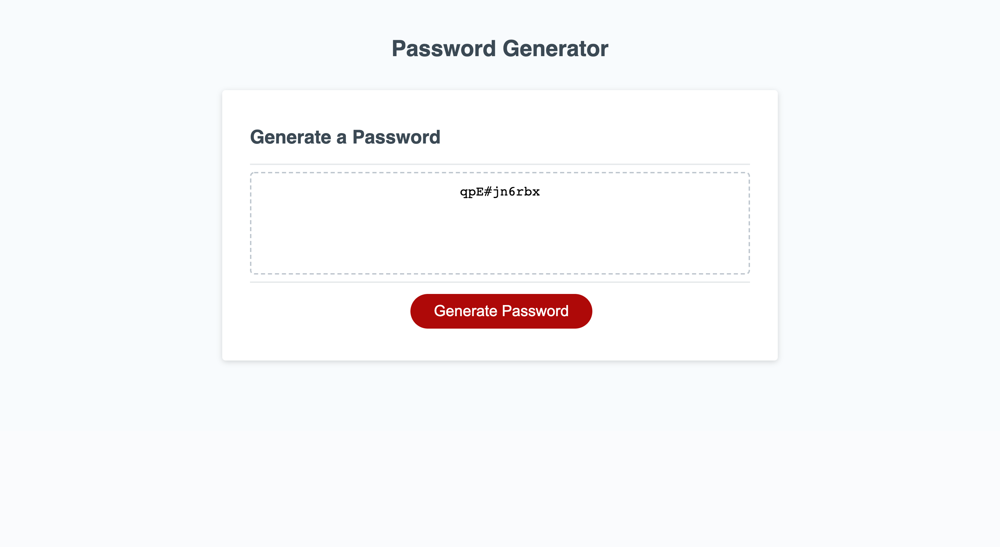

# Homework 3 Password Generator

## This is my 3rd homework assignment which is called Password generator. I had a tough time figuring this homework activity out, but I am glad I pushed through to get it done.

# My Journey

## There were a few parts of this homework activity that were difficult and a few of them are:

## 1. functions
## 2. Methods
## 3. Psudocode

# In Conclusion

## Again, I am glad I finished this assignemnd and I not only learned about Javascript but I also learned how to tackle problems in the future by laying a plan and attacking things one by one. 

# Image of Project

[Github](Github.com/Emilio512)

[Page](Github.com/Emilio512.io/Homework-3-Password-generator-EE)

